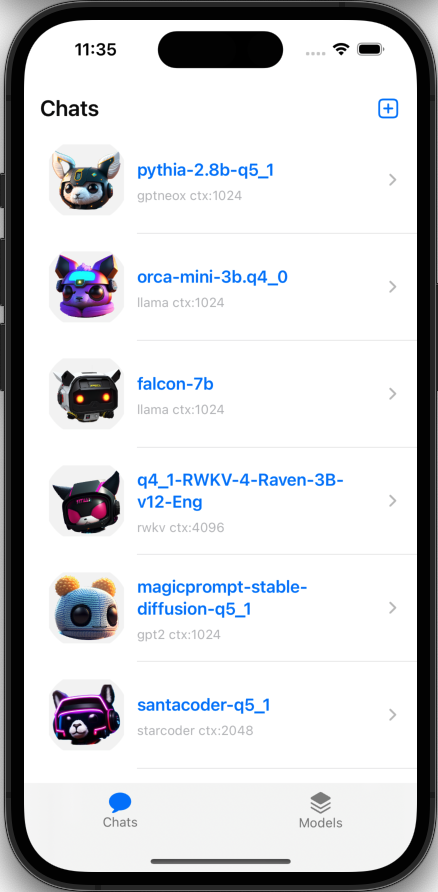
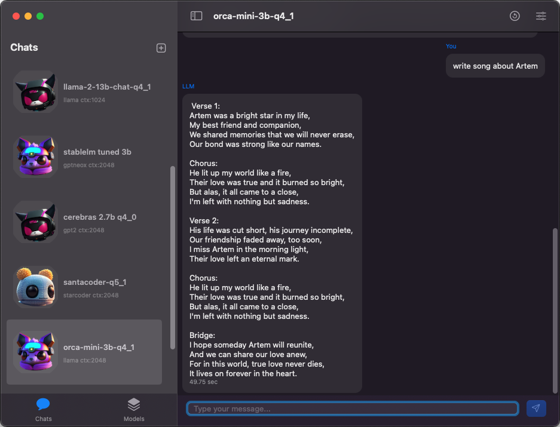

# LLMFarm

*If you are experiencing the error `extras.otherInstrOffset != 0 && "Kind::arm64_adrp_ldr missing extra info"` see the solution [here](https://github.com/guinmoon/LLMFarm/issues/19).*

<p align="center">
  <a href="https://apps.apple.com/ru/app/llm-farm/id6461209867?l=en-GB&platform=iphone"></a>
  <a href="https://testflight.apple.com/join/6SpPLIVM"></a>
</p>
<p align="center">
  <a href="https://apps.apple.com/ru/app/llm-farm/id6461209867?l=en-GB&platform=iphone"><strong>Install Stable&nbsp; &nbsp; &nbsp; &nbsp; &nbsp; &nbsp;</strong></a>
  <a href="https://testflight.apple.com/join/6SpPLIVM"><strong>&nbsp; &nbsp; &nbsp; &nbsp; &nbsp; &nbsp; &nbsp; Install Latest</strong></a>
</p>

<p align="center">
  
  
</p>

LLMFarm is an iOS and MacOS app to work with large language models (LLM). It allows you to load different LLMs with certain parameters.With LLMFarm, you can test the performance of different LLMs on iOS and macOS and find the most suitable model for your project.<br>
Based on [ggml](https://github.com/ggerganov/ggml) and [llama.cpp](https://github.com/ggerganov/llama.cpp) by [Georgi Gerganov](https://github.com/ggerganov).

Also used sources from:
* [rwkv.cpp](https://github.com/saharNooby/rwkv.cpp) by [saharNooby](https://github.com/saharNooby)
* [Mia](https://github.com/byroneverson/Mia) by [byroneverson](https://github.com/byroneverson)
* [LlamaChat](https://github.com/alexrozanski/LlamaChat) by [alexrozanski](https://github.com/alexrozanski)

# Features

- [x] MacOS (13+)
- [x] iOS (16+)
- [x] Various inferences
- [x] Various sampling methods
- [x] Metal ([dont work](https://github.com/ggerganov/llama.cpp/issues/2407#issuecomment-1699544808) on intel Mac)
- [x] Model setting templates
- [x] LoRA adapters support ([read more](./lora.md))
- [x] LoRA finetune support
- [x] LoRA export as model support
- [ ] Restore context state (now only chat history) 

# Inferences

- [x] [LLaMA](https://arxiv.org/abs/2302.13971) 
- [x] [GPTNeoX](https://huggingface.co/docs/transformers/model_doc/gpt_neox)
- [x] [Replit](https://huggingface.co/replit/replit-code-v1-3b)
- [x] [GPT2](https://huggingface.co/docs/transformers/model_doc/gpt2) + [Cerebras](https://arxiv.org/abs/2304.03208) 
- [x] [Starcoder(Santacoder)](https://huggingface.co/bigcode/santacoder) 
- [x] [RWKV](https://huggingface.co/docs/transformers/model_doc/rwkv) (20B tokenizer)
- [x] [Falcon](https://github.com/cmp-nct/ggllm.cpp) 
- [x] [MPT](https://huggingface.co/guinmoon/mpt-7b-storywriter-GGUF) 
- [x] [Bloom](https://huggingface.co/guinmoon/bloomz-1b7-gguf) 
- [x] [StableLM-3b-4e1t](https://huggingface.co/stabilityai/stablelm-3b-4e1t) 
- [x] [Qwen](https://huggingface.co/Qwen/Qwen-7B) 
- [x] [Yi models](https://huggingface.co/models?search=01-ai/Yi) 
- [x] [Deepseek models](https://huggingface.co/models?search=deepseek-ai/deepseek) 
- [x] [Mixtral MoE](https://huggingface.co/models?search=mistral-ai/Mixtral) 
- [x] [PLaMo-13B](https://github.com/ggerganov/llama.cpp/pull/3557) 
  
Note: For *Falcon, Alpaca, GPT4All, Chinese LLaMA / Alpaca and Chinese LLaMA-2 / Alpaca-2, Vigogne (French), Vicuna, Koala, OpenBuddy (Multilingual), Pygmalion/Metharme, WizardLM, Baichuan 1 & 2 + derivations, Aquila 1 & 2, Mistral AI v0.1, Refact, Persimmon 8B, MPT, Bloom* select `llama inferece` in model settings.

# Sampling methods
- [x] Temperature (temp, tok-k, top-p)
- [x] [Tail Free Sampling (TFS)](https://www.trentonbricken.com/Tail-Free-Sampling/)
- [x] [Locally Typical Sampling](https://arxiv.org/abs/2202.00666)
- [x] [Mirostat](https://arxiv.org/abs/2007.14966)
- [x] Greedy
- [x] Grammar (dont work for GPTNeoX, GPT-2, RWKV)
- [ ] Classifier-Free Guidance

# Getting Started

You can find answers to some questions in the [FAQ section](https://github.com/guinmoon/LLMFarm/wiki/FAQ).

## Inference options
When creating a chat, a JSON file is generated in which you can specify additional inference options. The chat files are located in the "chats" directory. You can see all inference options [here](/inference_options.md).

## Models
You can download some of the supported [models here](/models.md).


# Development
`llmfarm_core` has been moved to a [separate repository](https://github.com/guinmoon/llmfarm_core.swift). To build llmfarm, you need to clone this repository recursively:
```bash
git clone --recurse-submodules https://github.com/guinmoon/LLMFarm
```


# P.S.
The number of open source models is constantly growing. One of the advantages of using such models is the possibility of preserving their original content without censorship. However, a disadvantage may be the irrelevance of the information they contain. It is also possible to get answers to questions from different industries, for example, there are models that specialize in medical terms or programming.
In addition, you can use these models to create stories, songs, music, play quests, and so on...

