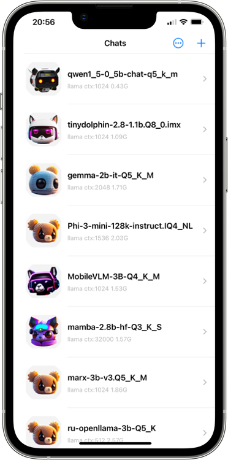

# LLMFarm

  

  
  

LLMFarm is a iOS and MacOS app to work with large language models (LLM). It allows you to load different LLMs with certain parameters. 
Based on [ggml](https://github.com/ggerganov/ggml) and [llama.cpp](https://github.com/ggerganov/llama.cpp) by [Georgi Gerganov](https://github.com/ggerganov).
Also, when creating the application, the source codes from the repository [byroneverson](https://github.com/byroneverson/Mia) were used.

## Features

- [x] MacOS (13+)
- [x] iOS (16+)
- [x] Various inferences
- [x] Metal for llama inference (MacOS and iOS)
- [ ] Metal for other inference
- [ ] Restore dialog (now only history) 
- [ ] Direct embedding input (LLaVA, etc.)
- [ ] Model setting templates

## Inferences

- [x] [LLaMA](https://arxiv.org/abs/2302.13971)
- [x] [GPTNeoX](https://huggingface.co/docs/transformers/model_doc/gpt_neox)
- [x] [Replit](https://huggingface.co/replit/replit-code-v1-3b)
- [x] [GPT2](https://huggingface.co/docs/transformers/model_doc/gpt2) + [Cerebras](https://arxiv.org/abs/2304.03208)
- [ ] [Starcoder(Santacoder)](https://huggingface.co/bigcode/santacoder)
- [ ] [RWKV](https://huggingface.co/docs/transformers/model_doc/rwkv)

## Getting Started

Models must be quantized by [ggml](https://github.com/ggerganov/ggml) after [#154](https://github.com/ggerganov/ggml/pull/154).
LLMFarm work in sandbox mode and put added models to the "models" directory. 
When creating a chat, a JSON file is generated in which you can specify additional model parameters. The chat files are located in the "chats" directory.

## Models
You can download some of the supported [models here](/models.md).

## Parameter list:

| parametr          | default           | description                                         |
|-------------------|-------------------|-----------------------------------------------------|
| title             | [Model file name] | Chat title                                          |
| icon              | ava0              | ava[0-7]                                            |
| model             |                   | model file path                                     |
| model_inference   | auto              | model_inference: llama \| gptneox \| replit \| gpt2 |
| prompt_format     | auto              | Example for stablelm:                               |
|                   |                   | `"<USER> {{prompt}} <ASSISTANT>"`                   |
| numberOfThreads   | 0 (max)           | number of threads                                   |
| context           | 1024              | context size                                        |
| n_batch           | 512               | batch size for prompt processing                    |
| temp              | 0.8               | temperature                                         |
| top_k             | 40                | top-k sampling                                      |
| top_p             | 0.95              | top-p sampling                                      |
| tfs_z             | 1.0               | tail free sampling, parameter z                     |
| typical_p         | 1.0               | locally typical sampling, parameter p               |
| repeat_penalty    | 1.1               | penalize repeat sequence of tokens                  |
| repeat_last_n     | 64                | last n tokens to consider for penalize              |
| frequence_penalty | 0.0               | repeat alpha frequency penalty                      |
| presence_penalty  | 0.0               | repeat alpha presence penalt                        |
| mirostat          | 0                 | use Mirostat sampling                               |
| mirostat_tau      | 5.0               | Mirostat target entropy, parameter tau              |
| mirostat_eta      | 0.1               | Mirostat learning rate, parameter eta               |

## Dev
To debug `llmfarm_core` package, do not forget to comment `.unsafeFlags(["-Ofast"])` in `Package.swift`.
Don't forget that the debug version is slower than the release version.

The number of open models is continuously growing. One of the advantages of using such models is the possibility of preserving their original content without censorship. However, the disadvantage may be the irrelevance of the information contained in them. You can also get answers to questions from various industries, for example, there are models that specialize in medical terms or programming.
In addition, with the help of these models, you can create stories, songs, music and play quests (more on that later).

