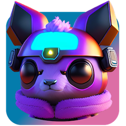
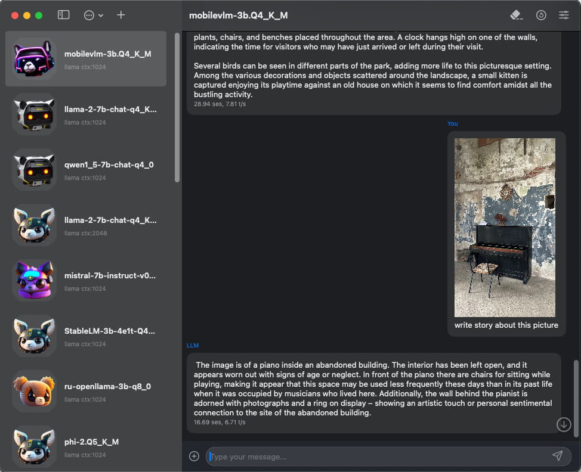

# LLMFarm
## Ru | [En](./README.md)

  

  
  

Приложение для iOS и MacOS предназначеное для работы с большими языковыми моделями (LLM). Оно позволяет загружать различные LLM с определенными параметрами.
Основано на [ggml](https://github.com/ggerganov/ggml) и [llama.cpp](https://github.com/ggerganov/llama.cpp) от [Georgi Gerganov](https://github.com/ggerganov). 
Так же при создании приложения были использованы исходные коды из репозитория [byroneverson](https://github.com/byroneverson/Mia).

Список поддерживаемых моделей:

| model                                                                              | inference | size | quantized link                                                                                              | iOS (iphone 12 pro max) | MacOS  |
|------------------------------------------------------------------------------------|-----------|------|-------------------------------------------------------------------------------------------------------------|-------------------------|--------|
| [OpenLLaMa](https://github.com/openlm-research/open_llama)                         | LLaMA     | 3B   | [hug](https://huggingface.co/guinmoon/LLMFarm_Models/resolve/main/openllama-3b-350bt-ggml_v3-q4_0.bin)      | ok                      | ok     |
| [StableLM Tuned Alpha](https://huggingface.co/stabilityai/stablelm-tuned-alpha-3b) | GPT-NeoX  | 3B   | [hug](https://huggingface.co/guinmoon/LLMFarm_Models/resolve/main/stablelm-tuned-alpha-3b-ggml_v3-q5_1.bin) | ok                      | ok     |
| [Dolly v2](https://github.com/databrickslabs/dolly)                                | GPT-NeoX  | 3B   | [hug](https://huggingface.co/guinmoon/LLMFarm_Models/resolve/main/dolly-v2-3b-ggml_v3-q5_1.bin)             | ok                      | ok     |
| [RedPajama](https://huggingface.co/togethercomputer/RedPajama-INCITE-Base-3B-v1)   | GPT-NeoX  | 3B   |                                                                                                             | running, but            | ok     |
| [RWKV-4 "Raven"](https://huggingface.co/BlinkDL/rwkv-4-raven)                      | GPT-NeoX  | 3B   |                                                                                                             | in dev                  | ok     |
| [Pythia](https://huggingface.co/EleutherAI)                                        | GPT-NeoX  | 2.8B | [hug](https://huggingface.co/guinmoon/LLMFarm_Models/resolve/main/pythia-2.8b-ggml_v3-q5_1.bin)             | ok                      | ok     |
| [Llama](https://arxiv.org/abs/2302.13971)                                          | LLaMA     | 7B   |                                                                                                             | bad alloc               | ok     |
| [Alpaca](https://crfm.stanford.edu/2023/03/13/alpaca.html)                         | LLaMA     | 7B   |                                                                                                             | bad alloc               | ok     |
| [Vicuna](https://lmsys.org/blog/2023-03-30-vicuna/)                                | LLaMA     | 7B   |                                                                                                             | bad alloc               | ok     |
| [Vicuna](https://lmsys.org/blog/2023-03-30-vicuna/)                                | LLaMA     | 13B  | [hug](https://huggingface.co/vicuna/ggml-vicuna-13b-1.1/resolve/main/ggml-vic13b-uncensored-q4_1.bin)       | bad alloc               | ok     |
| [WizardLM](https://arxiv.org/abs/2304.12244)                                       | LLaMA     | 7B   |                                                                                                             | bad alloc               | ok     |
| [Cerebras](https://huggingface.co/cerebras/Cerebras-GPT-2.7B)                      | GPT-2     | 2.7B |                                                                                                             | in dev                  | in dev |

Модели должны поддерживаться [ggml](https://github.com/ggerganov/ggml) после [#154](https://github.com/ggerganov/ggml/pull/154).

В текущий момент загрузка 7B моделей на реальном устройстве iOS вызывает ошибку bad alloc, в то время как в симуляторе все работает без проблем. Возможно, для решения проблемы необходимо добавить extended-memory.

Приложение работает в режиме песочницы и помещает добавленные модели в директорию "models". Версия для MacOS, вместо перемещения модели в песочницу, создаст символическую ссылку на файл модели в директории "models".

При создании чата формируется JSON-файл, в котором можно указать дополнительные параметры модели. Файлы чатов расположены в директории "chats".

Список параметров:

| parametr          | default           | description                                                                 |
|-------------------|-------------------|-----------------------------------------------------------------------------|
| title             | [Model file name] | Chat title                                                                  |
| icon              | ava0              | ava[0-7]                                                                    |
| model             |                   | model file path                                                             |
| model_inference   | auto              | model_inference: llama \| gptneox                                           |
| prompt_format     | auto              | Example for stablelm:                                                       |
|                   |                   | `"<USER> {{prompt}} <ASSISTANT>"`                                           |
| numberOfThreads   | 0 (max)           | number of threads (for MacOS i recomend set your processor thread count -2) |
| context           | 2048              | context size                                                                |
| n_batch           | 512               | batch size for prompt processing                                            |
| temp              | 0.8               | temperature                                                                 |
| top_k             | 40                | top-k sampling                                                              |
| top_p             | 0.95              | top-p sampling                                                              |
| tfs_z             | 1.0               | tail free sampling, parameter z                                             |
| typical_p         | 1.0               | locally typical sampling, parameter p                                       |
| repeat_penalty    | 1.1               | penalize repeat sequence of tokens                                          |
| repeat_last_n     | 64                | last n tokens to consider for penalize                                      |
| frequence_penalty | 0.0               | repeat alpha frequency penalty                                              |
| presence_penalty  | 0.0               | repeat alpha presence penalt                                                |
| mirostat          | 0                 | use Mirostat sampling                                                       |
| mirostat_tau      | 5.0               | Mirostat target entropy, parameter tau                                      |
| mirostat_eta      | 0.1               | Mirostat learning rate, parameter eta                                       |

Количество открытых моделей постоянно растет. Из преимуществ использования таких моделей можно выделить возможность сохранения их оригинального содержания без цензуры. Однако недостатком может являеться неактуальность информации, содержащейся в них. Также можно получать ответы на вопросы из различных отраслей, например, существуют модели, специализирующиеся на медицинских терминах или программировании.
Кроме того, с помощью этих моделей можно создавать истории, песни, музыку и играть в квесты (об этом позже).